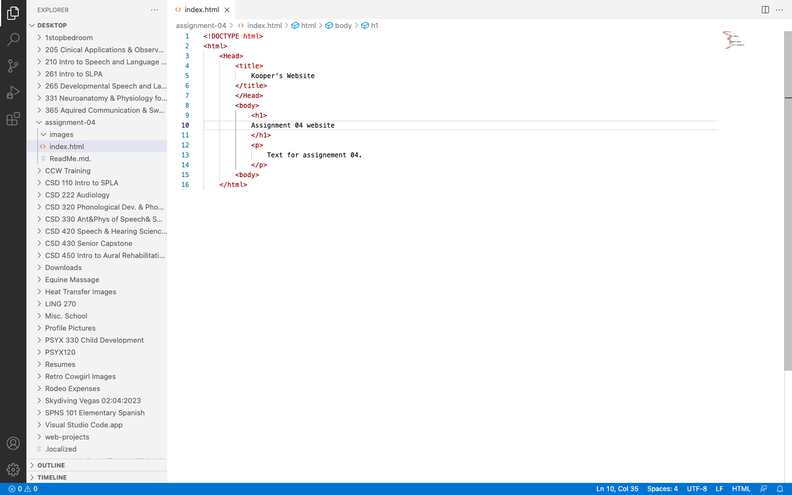

Web browsers work when a request is sent to a server.
The server responds with a collection of web content 
The browser that sent the initial request interprets the content and then displays the page.

Browsers I currently surf quite often include:
Google Chrome, which I use on my computer and iPad for everything. 
Safari, which I use on my phone. 

