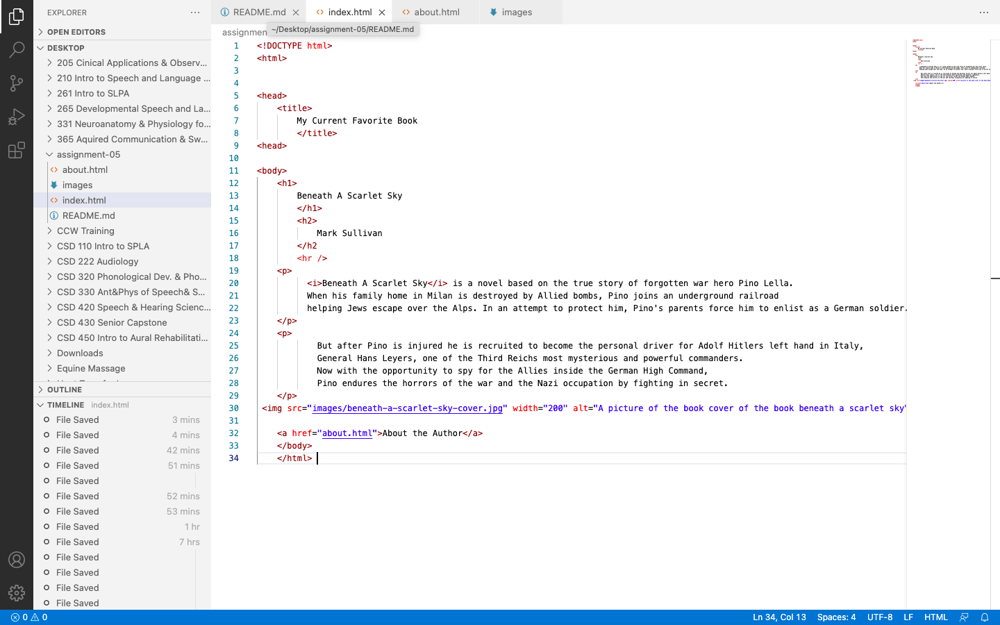

Tell me about a website you visited using The Wayback Machine. What year was it from? How is the older version different from the new version in terms of its overall design?

I visted nextflix.com from January 17 1999.
The website was very unoragnized and you had to rent each movie you wanted to watch. When you rented a movie they would mail you a physical disc that you would recieve within 2-3 days. After you watched it you had 7 days to  mail it back or you would be charged for it.
The website was basic colors and did not include images of the movie title you were searching for. 
Netflix today is and instantaneous way to watch shows and movies with a click of a buttom. It is colorful and includeds many pictures of what show you are wanting to watch. You no longer rent a moie online and recieve a disc in the mail. You recieve access to the movie instantly. It is definietly updated from 1999. 

