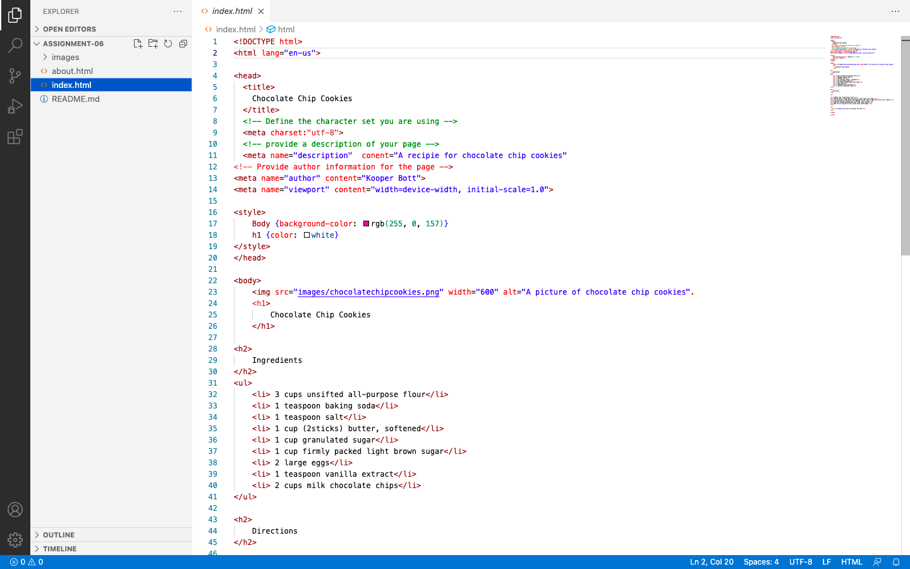

Describe the difference between structural and semantic makeup. 

The main difference between structural and semantic makeup is what they explain. The semantic makeup explains the purpose of an element and the structural makeup explains the relation of its content to the content of other elements within a document.

 