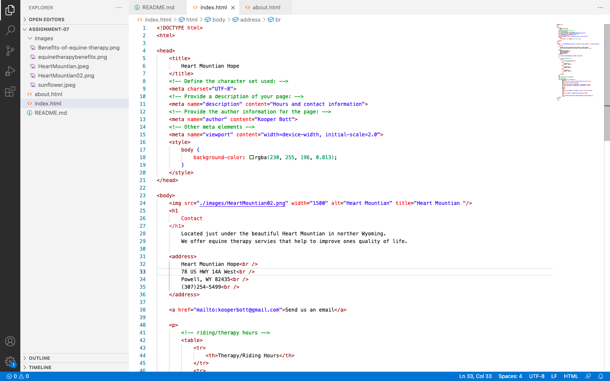
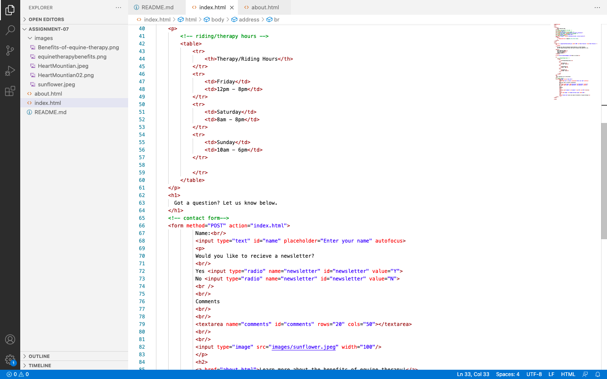

Please describe any forms you've come across while browsing the web. What purposes do they serve?

I have come across many different forms on the web. The most common would be when a box pops up on a website for you to subscribe to recieve emails from the company whos website you are looking at. 
Another example of forms was found in the applicaiton to apply to the University of Montana. The online application have many forms where information such as birthdates, addresses, phone numbers, and other personal information was collected. There were drop down menus that asked what year of school you were in, if you had been in the military, and so on.
Forms are vital for collecting information from users on the web. 

Screen shots of work

