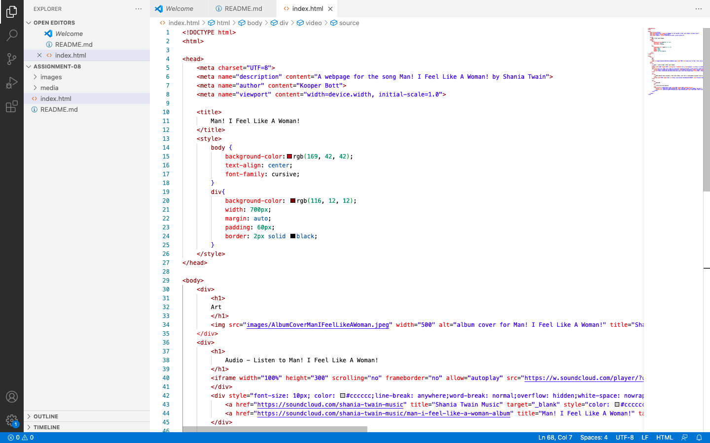

What is an affordance?
Affordane is something on the webpage that helps, aids, or makes it possible for the user to do something on the page. Such as a underlined text that indicates a link to elsewhere. It is obvious that if you click on the underlined text it would take you to another page with information similar to the underlined texted you originally clicked on. 

What are the advantages and disadvantages of using a third-party service like YouTube or Vimeo to host your videos?
The biggests advantage is that they are free to use. The biggest disadvangate is that some of the material you want to use cannot be embedded easily because of copyright. I ran into that problem with finding a YouTube video of my song without it being copyrighted. It was impossible to do as all the video of Shania Twain were all copyrighted. I was able to still embed it on my page but you have to click the link on the video box to watch it on YouTube. Another advantage is that you are able to copy the premade code into your own work.

Optional: What challenges did you face this week with this assignment? How did you overcome them?
My biggest challenge was not being able to find a YouTube video that was not copyrighted. Every single video I found of Shania Twain singing Man! I Feel Like A Woman! was copyrighted. I still embedded one of the copyrighted videos and it allows the used to click inthe video box to watch it on YouTube. 
I was also unable to get everythign to line up exactly but I was able to get it closer than it originally was. I think I needed to add in more 
 sections. 

Screenshot of work
 