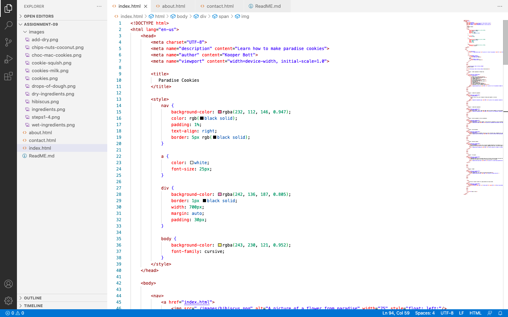

Briefly recap your experience learning HTML. What was old, new, interesting, or difficult to learn?

Learing HTML has been a frustrating experience for me. Everything that I have learned has been new so I have struggled with understanding how it all works. It has been rewarding to figure out how to link multiple HTML pages together and see everything come together to make a cohesive site with multiple pages that all have the ability to link to one another. I have still struggled with some images. Like this week, I tried to take my own pictures of my cookie steps but when I uploaded them to my computer and added them to my images file they wouldn't work. When I found and saved images off the internet to my assignemtns image file I was able to get them to work on my website. I am still not sure why my own images wouldn't work. I was able to upload my own video to YouTube and link it to my website correctly, so I count that as a win. 

After we come back from spring break we will start to dive into CSS and expand on styling, which helps us "decorate" HTML. Is there anything you're anxious or excited to learn about in this new section?

I am excited to learn more styling concepts as I feel the websites I have been creating are lacking in style. While I have learned how to change colors, fonts, and create boarders I am looking forward to making all of those elements more "exciting".
I am anxious about having to rember new stuff. There is so much to all of this! 

Screenshot of work 
