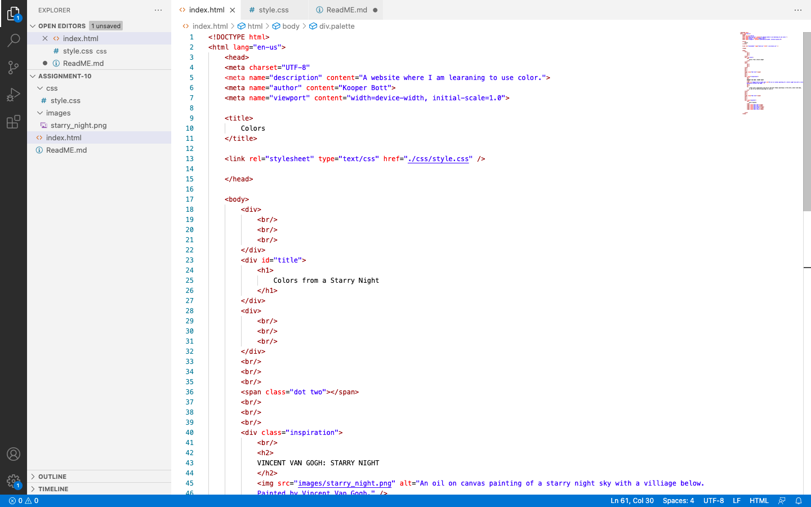
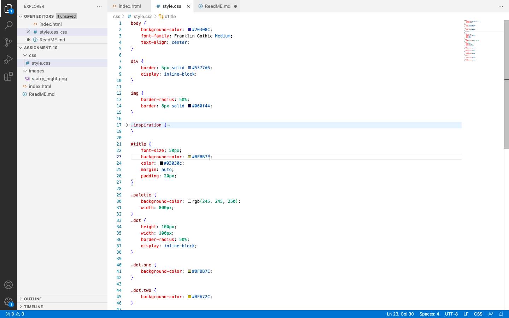

Describe the difference between the universal, element, class, and id selector types. When might you choose one over the other to style content?

universal: used to style every element on a page. The universal selector is the star (*). The star is often used in computer science to mean “all.” You would chose this if you wanted to style every element on the page. 

element: used to select all elements of a certain type. This selector is applied by using an element name (the reserved keyword placed in the opening tag of an element). Ex:  that I used this week to create the dots on my color palette. You would use this for specific areas that you wanted to add in.

class: starts with a dot (.) character. It will select everything in the document with that class applied to it. 
can also be used to style elements. You would want to use the class selectors to select elements that serve the same function.

id selector: Just like the class selector, the ID selector allows developers to define style rules for a specific element by calling its unique ID. ID names start with a number sign (#). Yould use this to style more individual elements as oppsed to everything on the page like the universal and class selectors would.

Discuss your color palette. How did you choose your colors?
To pick the colors for my webpage I chose one of my favorite paintings, Starry Night by Vincent Van Gogh. I used the adobe color
palatte generator to get the correct color codes to input into visual studio. I did this by uploading a photo if the painting into the generator and it gave me the main color palette of the painting. I am very drawn to the colors in this painting. There is a lot of dark blues and greens with brighter colors to break them up which convey a feeling of hope even when you are in times of darkness.

Screenshots of work
HTML
 

CSS
 