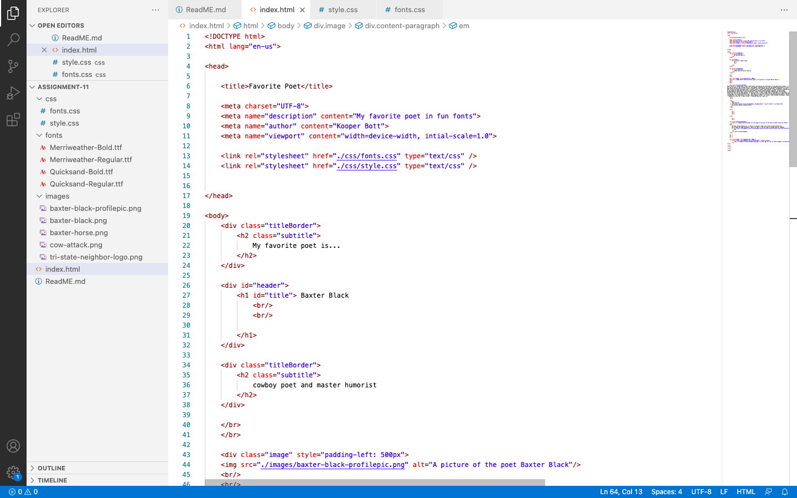

What is typography?

Typography is the art and technique of arranging type to make written language legible, readable, and
appealing when displayed. -Wikipedia 

What is the importance of having fallback fonts or a font stack?
It's important to have a fallback font so that there is a backup font if the primary font doesn't load right away or is missing something so that it doesn't render properly.

What is the difference between a system font, web font, and web-safe font?

system font: Fonts that are already installed on deviced by default. Work on all devices. These are the same as web-safe fonts.  

web font: Do not come installed on most devices by default.  They are are hosted on the web and then downladed by the browser while loading the web page. 

Screenshot of work

