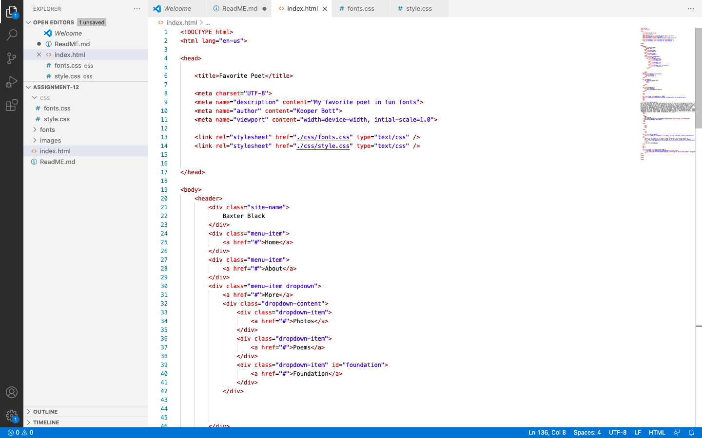
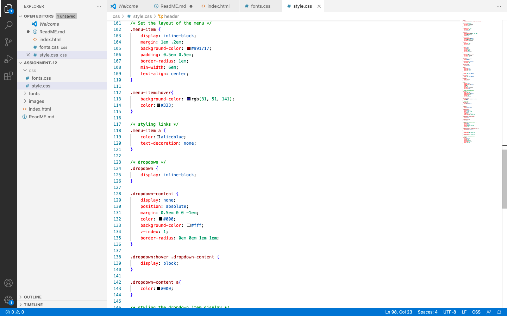

What is the difference between padding, margin, and borders?

padding: is the amount of space between the inner content of the element and the element itself.

margins: is the space between the box/element and other elements, or the edge of the parent element.

borders: define the amount of space a box or element takes up, as well as its relationship to other boxes. Borders are more of a visual styling tool, than a space management tool.

Optional: how did this week's assignment go? What challenges did you face, and how did you overcome them?

I forgot to move everything from a week11 folder to a week 12 folder but eventually figured out my mistake so I could build off my last assignment. 
I am also struggling with getting the content paragraph in the middle of my page to center without moving everything else. Help!

Screenshots of work:

